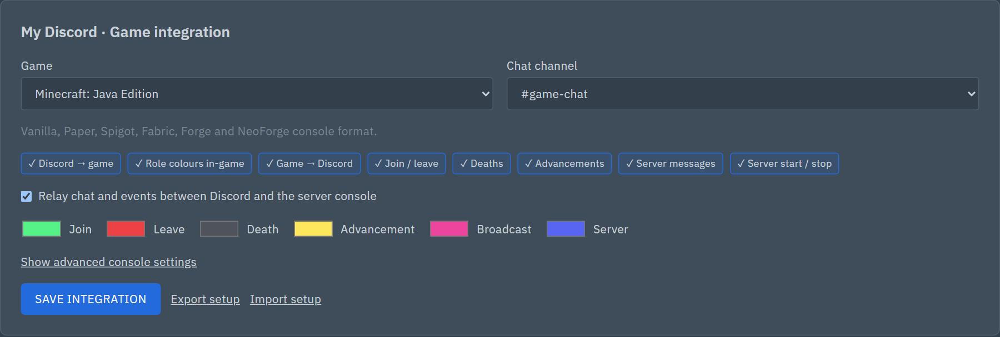
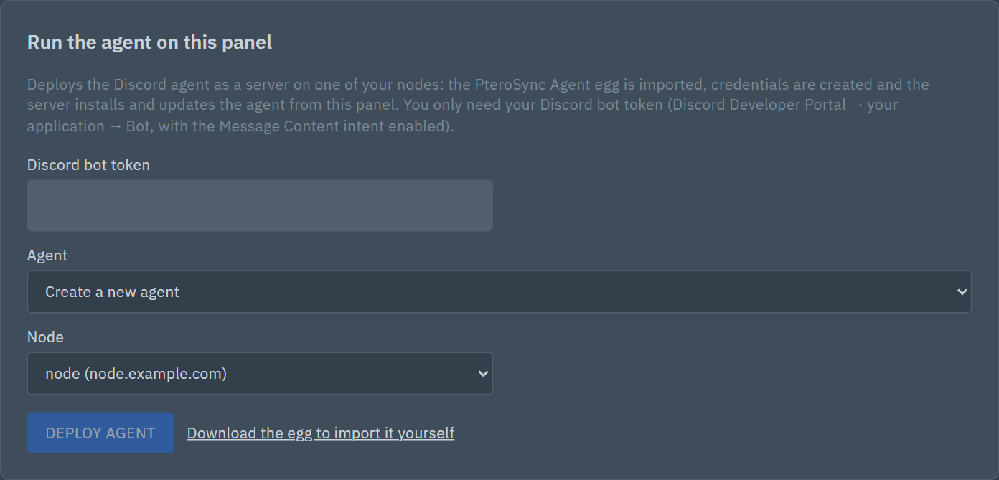
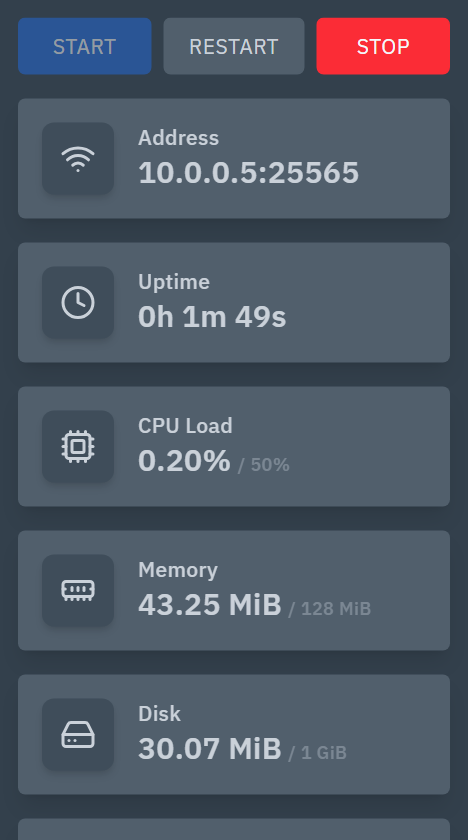
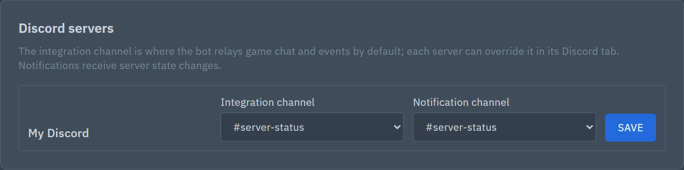
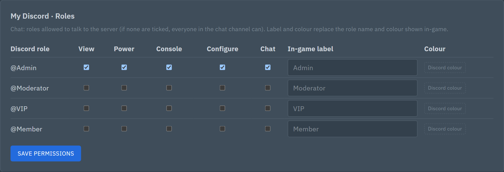
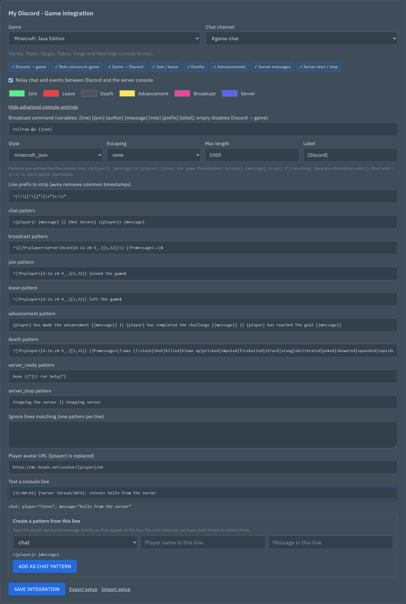

# PteroRelay

Discord integration for **Pterodactyl Panel 2.0**. You can control game servers
from Discord, give Discord roles access to individual servers, and relay chat and
events between Discord and the game in both directions. Chat works for any game
with a console: no game mods or plugins are needed.

PteroRelay has two parts:

- **The extension** is installed in the panel. It stores Discord servers, role
  permissions and settings, and authorizes every action.
- **The agent** is the Discord bot. It runs as an ordinary Pterodactyl server on
  one of your nodes, so it needs no extra infrastructure.



> **Beta.** PteroRelay targets Pterodactyl Panel 2.0 development builds (SDK
> `2.0.0-beta.4`). Back up the panel database before upgrades.

---

## Installation

### 1. Create the Discord bot

1. Open the [Discord Developer Portal](https://discord.com/developers/applications)
   and click **New Application**.
2. Under **Bot**:
   - click **Reset Token** and copy the token;
   - under *Privileged Gateway Intents*, enable **Message Content Intent**.
3. Under **OAuth2 → URL Generator**:
   - select the scopes `bot` and `applications.commands`;
   - select the bot permissions **View Channels**, **Send Messages**, **Embed
     Links**, **Read Message History**, **Add Reactions** and **Manage Webhooks**.
4. Open the generated URL and add the bot to your Discord server.

### 2. Install the extension

1. Download [`pterorelay-discord.zip`](https://github.com/Skwarc/pterorelay/releases/latest/download/pterorelay-discord.zip)
   from the [latest release](https://github.com/Skwarc/pterorelay/releases/latest).
2. In the panel, open **Admin → Extensions → Install**, upload the file and make
   sure the extension is enabled. Or, on the panel host:

   ```sh
   php artisan p:extension:install /path/to/pterorelay-discord.zip --enable
   ```

If the panel itself runs in Docker, keep the extension directories on persistent
volumes, otherwise extensions disappear when the panel container is recreated:

```yaml
services:
  panel:
    volumes:
      - pterodactyl-extensions:/app/extensions
      - pterodactyl-extension-assets:/app/public/assets/extensions
```

### 3. Deploy the agent

1. Open **Admin → PteroRelay → Run the agent on this panel**.
2. Paste the bot token and choose a node.
3. Click **Deploy agent**.



The panel then:

- imports the **PteroRelay Agent** egg;
- creates the agent's credentials;
- creates a small server (128 MB RAM, one free allocation that the agent does not
  listen on), which downloads the agent from your panel and starts it.

The agent is running when its console shows `PteroRelay agent ready` and it appears
as connected in **Admin → PteroRelay**. The agent never stops, restarts or sends
commands to the server it runs on.



The agent idles at about 45 MB of memory and close to 0% CPU. Its server gets
128 MB, which leaves room for the dependency install on first start.
<br clear="right">

If a step fails, the step list shows which one. The manual route is:

1. Click **Download the egg to import it yourself** and import it under **Eggs**.
2. Create agent credentials in **Admin → PteroRelay**.
3. Create a server from the egg and fill in the token, agent ID and secret.

### 4. Connect your servers

1. In **Admin → PteroRelay → Discord servers**, choose the **Integration channel**,
   the default channel for game chat. Optionally also choose a **Notification
   channel** for start/stop messages.

   

2. Open a game server in the panel and go to its **Discord** tab.
3. Link the Discord server.
   - **Panel administrators** pick it from the list.
   - **Everyone else** needs a link code: someone with *Manage Server* in that
     Discord server runs `/link`, and the server owner enters the code (valid for 15
     minutes, single use). This stops anyone from attaching a server to a Discord
     community that did not agree to it. The tab walks customers through it, with
     an **Add the bot to your Discord** button that opens the bot's invite link.
4. In the roles table, give roles **View**, **Power**, **Console**, **Configure**
   or **Chat**.
5. Under **Game integration**, choose the game, tick **Relay chat and events** and
   click **Save integration**. The **Notification channel** there sets where this
   server's start, stop and crash messages go (default: the Discord server's).
6. To disconnect a Discord server, click **Unlink** next to its name; its roles and
   settings for this game server are deleted.

In Discord, `/server manage` now shows the server. Messages in the chat channel go
to the game, and game chat comes back to Discord.

---

## Updating

1. Upload the new `.pteroext` in **Admin → Extensions**.
2. Restart the **PteroRelay Agent** server.

On every start the agent compares its version with the extension's and, if they
differ, downloads the matching agent from the panel. To pin a version, set
**Auto update** to `0` in the agent server's **Startup** tab.

To be told about new releases, set **GitHub repository** (`owner/name`) under
**Admin → Extensions → PteroRelay Discord → Settings**. **Admin → PteroRelay** then
shows a banner when a newer release exists. The same setting points the community
preset library at the repository.

## Checking the setup

**Admin → PteroRelay** starts with a **Setup checklist**:

- the agent is connected and on the same version as the extension;
- the Discord bot and its Message Content intent, with an invite link carrying the
  right permissions;
- whether the bot has joined a Discord server;
- the integration channels;
- whether any server relays game chat.

Under it, **Diagnostics** lists the problems the agent reports with every heartbeat,
with the affected server and since when, so you don't have to read the agent's log:

- consoles it cannot read;
- Discord → game messages that failed;
- missing chat channels;
- missing Send Messages or Manage Webhooks permissions.

Before deploying, **Check token** validates the bot token with Discord and warns
when the Message Content intent is off.

---

## Features

- **Server control from Discord:** start, stop, restart, status, uptime, an
  interactive `/server manage` panel and authorized console commands.
- **Permissions per Discord role and server:** view, power, console, configure
  and chat. Every action is checked by the panel, and power actions and console
  commands are audited.
- **Notifications** in a chosen channel when a server changes state.
- **Two-way game chat through the Wings console.**
  - Discord messages are sent to the game with a console command, showing the
    author's role label and colour where the game supports colours.
  - Game chat is posted in Discord through a webhook under the player's name and
    avatar.
  - Joins, leaves, deaths, advancements, server messages (`say`) and server
    start/stop are posted as coloured embeds.
- **Game presets with per-server overrides,** written in an easy pattern syntax,
  with a line tester, a pattern generator and import/export of game setups.
- **English and Slovenian** bot replies (the `DEFAULT_LOCALE` setting, or each
  user's Discord language).

## Discord commands

| Command | Purpose |
| --- | --- |
| `/server manage` | Interactive control panel: start, stop, restart, refresh, settings |
| `/start`, `/stop`, `/restart` | Power actions |
| `/status` | State and resource usage of one server; without a server, a list of every linked server with state, players and chat relay |
| `/uptime` | Recorded uptime |
| `/console` | Send a console command (requires the **Console** permission) |
| `/settings` | Link to the server's settings in the panel |
| `/link` | Create a code that links a panel server to this Discord server (*Manage Server* only) |
| `/setstatusmsg`, `/removestatusmsg` | Post (or remove) a status embed in this channel that updates every 30 s (*Manage Server* only) |

Each command only shows the servers your Discord roles may view. The bot's own
status ("Watching 3 servers · 2 online · 5 players") is a total with no server
names, because every Discord server the bot is in can see it.

Servers are linked, and roles given access, in the panel; the bot has no setup
commands. To limit the channels where members can use the bot, use Discord's
**Server Settings → Integrations → PteroRelay**.

---

## Game chat and events

Chat only uses the Wings console:

- **Discord → game:** the agent asks the panel to run a broadcast command, such as
  `tellraw @a …` or `say …`.
- **Game → Discord:** the agent follows the server's console live over the Wings
  websocket, the same stream as the console page in the panel, and recognises
  chat, join, leave, death, advancement, server-message and start/stop lines.
  - The panel gives the agent a 10-minute token for each server that can only
    read the console: it cannot send commands or power actions. The agent
    renews it before it expires.
  - While a websocket is down (for example, when the node's Wings port cannot be
    reached from the agent), the agent reads the recent console output through the
    panel every `CONSOLE_POLL_SECONDS` (3 by default) until the websocket is back.
    `CONSOLE_MODE` switches this off or makes polling the only method.

### Presets

| Game | Discord → game | Game → Discord | Status |
| --- | --- | --- | --- |
| Minecraft: Java (Vanilla, Paper, Fabric, Forge, NeoForge, 26.3+) | `tellraw` with role colours | chat, `say`, join/leave, deaths, advancements, start/stop | verified |
| Minecraft: Bedrock (BDS) | `tellraw` with § colours | join/leave, start/stop (BDS does not log chat) | likely |
| Terraria (vanilla, TShock 6+) | `say` with colour tags | chat, server messages, join/leave | likely |
| Rust | `say` with rich-text colours | chat, server messages, join/leave | likely |
| Source engine (CS2, CS:S, TF2, L4D) | `say` | chat, server messages, join/leave without bots (needs `log on`, `sv_logecho 1`) | likely |
| Valheim | — | deaths | likely |
| Custom | your command | your patterns, for any game with a console | — |

**verified:** tested on a real server. **likely:** matches the game's documentation,
source code or logs posted by other projects, but not yet tested by us. Check your
console with the line tester, and please report lines that don't match.

The badges under the chosen game are switches. Click one to turn that feature off
for the server; turned-off features are greyed out.

### Roles and colours

- **Chat** in the roles table limits who may talk to the server. If no role is
  ticked, everyone in the channel can.
- **In-game label** and **Colour** set how a role appears in the game. By default
  the member's highest displayed (hoisted) role and Discord colour are used.



### Writing patterns

Under **Show advanced console settings**, write patterns the way the line looks in
the console:

```text
Line prefix:        auto
Broadcast command:  say {line}
chat pattern:       <{player}> {message}
join pattern:       {player} joined the game || {player} connected
```

- `{player}`, `{message}` and `{rank}` capture text; `{*}` matches anything.
- Spaces match any amount of whitespace, and other characters match literally.
- Separate alternatives with `||`.
- A pattern starting with `^` or `re:` is a Python regular expression.
- `auto` as the line prefix removes common timestamps and log levels.
- Broadcast command variables: `{line}`, `{json}`, `{author}`, `{message}`,
  `{role}`, `{prefix}`, `{label}`.

<details>
<summary>Screenshot: advanced console settings with the line tester</summary>



</details>

To check a pattern, paste a console line into **Test a console line**. **Create a
pattern from this line** turns a sample line into a pattern for you. **Export
setup** and **Import setup** save and load a game's settings as a JSON file.
**Browse presets** lists ready-made setups from the community preset library (see
below).

When no game is chosen yet, the **Game** list preselects the preset that matches
the server's egg or Docker image (for example a Paper or Forge egg suggests
Minecraft: Java Edition). It is only stored when you click **Save integration**.

### Sharing a game setup

The community preset library is the [`presets/`](presets/) folder of this
repository. The panel reads `presets/index.json` and the setups through jsDelivr
(`https://cdn.jsdelivr.net/gh/Skwarc/pterorelay@main/presets/`). The extension setting
**repository** (`Skwarc/pterorelay` by default) also drives the update check; point it at a fork
to use your own library. The presets built into the agent (`adapters/presets/`) keep
working without it.

To add your setup:

1. Configure the game on a real server and check its console lines with **Test a
   console line**.
2. Click **Export setup** and save the file as `presets/<game>-<variant>.json`
   (lowercase letters, digits and dashes).
3. Add the library fields to the file:

   ```json
   {
     "format": "pterorelay-game",
     "version": 1,
     "name": "Terraria – TShock 5",
     "description": "What it changes, which server versions it is for, and known limits.",
     "author": "your GitHub name",
     "status": "verified",
     "game": "terraria",
     "overrides": { "in": { "patterns": { "chat": "{player}: {message}" } } },
     "event_colors": null,
     "disabled_features": []
   }
   ```

   `status` is `verified` if you tested it on a real server, `likely` if it is based
   on documentation or logs posted by others, otherwise `unverified`. `game` must
   be one of the built-in presets (`generic` for any other game).
4. Run `python scripts/build_preset_index.py`. It checks every setup (format, game,
   required fields, patterns that compile) and rewrites `presets/index.json`.
5. Open a pull request with both files and a few sample console lines the setup
   matches.

---

## Alternative: run the agent with Docker

If you prefer not to run the agent on a node:

1. Create agent credentials in **Admin → PteroRelay → Discord agent**. The secret is
   shown only once.
2. Set up the agent:

   ```bash
   git clone https://github.com/Skwarc/pterorelay.git pterorelay && cd pterorelay
   cp .env.example .env   # set DISCORD_TOKEN, PANEL_PUBLIC_URL, PTERORELAY_AGENT_ID, PTERORELAY_AGENT_SECRET
   docker compose up -d --build
   ```

To update, run `./scripts/update-agent.sh`, which pulls the code and rebuilds the
container. The agent only needs outbound HTTPS to the panel and, for the live
console, to the Wings port of your nodes; no ports are published.

## Agent settings

| Variable | Default | Meaning |
| --- | --- | --- |
| `DISCORD_TOKEN` | — | Discord bot token |
| `PANEL_PUBLIC_URL` | — | Public URL of the panel |
| `PTERORELAY_AGENT_ID`, `PTERORELAY_AGENT_SECRET` | — | Agent credentials from **Admin → PteroRelay** |
| `DEFAULT_LOCALE` | `en` | Default reply language (`en` or `sl`) |
| `LOG_LEVEL` | `INFO` | `DEBUG` logs every console line the relay reads |
| `CONSOLE_MODE` | `auto` | `auto`: Wings websocket, polling while it is down; `websocket`: never poll; `poll`: never open websockets |
| `CONSOLE_POLL_SECONDS` | `3` | How often game consoles are polled when no websocket covers them |
| `AUTO_UPDATE` | `1` | Agent server only: update to the extension version on start |
| `API_CONCURRENCY` | `5` | Parallel requests to the panel |

---

## Troubleshooting

| Symptom | Check |
| --- | --- |
| Agent not connected | The agent server's console: `PteroRelay agent ready` should appear. Check that `PANEL_PUBLIC_URL` is reachable from the node. |
| Discord tab says the bot is offline | The panel has had no heartbeat from that bot's agent for over 90 s. Check **Admin → PteroRelay** for its last heartbeat and that the agent server is running; then see *Agent not connected*. |
| Discord message gets a ⚠️ reaction | The relay to the game failed; the agent log shows `Chat relay to … failed`. |
| `Wings websocket for … is unavailable` in the agent log | Chat still works through polling. The agent must reach the node's Wings address (FQDN and port, as in the panel's console page). `HTTP 403` means Wings refused the Origin: the panel URL in Wings' `config.yml` (`remote`) must match the panel's `APP_URL`. |
| Game chat does not reach Discord | Set `LOG_LEVEL=DEBUG` and restart the agent. Each console line is logged with `-> no match` or the event it became, which shows whether the pattern needs adjusting. Also check the **Relay chat and events** switch. |
| Messages appear as the bot, not the player | Give the bot **Manage Webhooks** in the chat channel. |
| `PrivilegedIntentsRequired` | Enable **Message Content Intent** for the bot. |
| Slash commands missing | Re-invite the bot with the `applications.commands` scope. |

## How it works

- The agent talks to the extension over HTTPS. Every request is signed with HMAC
  using the agent's secret and protected against replay.
- The agent has no Pterodactyl API key. Power actions, console commands and chat
  go through the extension, which checks the Discord user's roles against the
  server's permissions.
- The extension serves the agent's code at `/pterorelay-agent/bundle`, which keeps
  the agent and extension versions in step.
- Discord servers the bot has left (kicked or removed) are kept for 30 days, then
  deleted together with their links, roles and settings. Deleting a game server
  removes its links too.

## Development

The extension builds and is tested against the panel's source, which is not on npm
yet. `scripts/panel_check.py` clones it into `.panel` at the repository root (it is
git-ignored) and needs Docker:

```bash
python scripts/panel_check.py                 # PHPStan + PHP tests against the panel
cd pterorelay-discord && npm ci && npm run build && cd ..

python -m unittest discover -s tests          # agent tests
python scripts/release.py --no-push           # full local build into release/
python scripts/release.py --bump              # test, build, tag and push a release
python scripts/verify_panel.py https://panel.example.com   # after uploading
```

`scripts/panel_check.py` runs, inside the panel checkout:

- **PHPStan** on the extension with the panel's own types, so a wrong class, method
  or argument fails the build instead of a live panel;
- the **Pest tests** in `pterorelay-discord/tests` with the panel's test harness and a
  MySQL container: agent request signing and replay, the agent never controlling its
  own server, the chat command check, link codes and the permission rules.

The soak test (fake game servers and a checker bot that measure delivery for days)
is described in [soak/README.md](soak/README.md).

`scripts/release.py`:

1. sets the version;
2. runs the Python tests, `php -l` and `scripts/panel_check.py`;
3. type-checks and builds the panel frontend;
4. builds the agent bundle and the `.pteroext`;
5. builds the Docker image;
6. commits, tags and pushes;
7. with `--panel URL` (or `PTERORELAY_PANEL_URL`), waits until that panel serves the
   new version after you upload it, and fails if the extension is disabled or broken.

A `v*` tag also runs CI (`.github/workflows/build.yml` on GitHub,
`.gitea/workflows/release.yml` on Gitea), which builds and publishes the release with
a stable `pterorelay-discord.zip` asset. The package contains what the panel's own
`p:extension:pack` would: the manifest, README, LICENSE, `routes`, `database`,
`resources` (including the agent bundle), `dist` and `src`.

| Path | Contents |
| --- | --- |
| `bot.py`, `agent_client.py`, `chat_relay.py`, `wings_console.py`, `i18n.py`, `update_agent.py` | Agent |
| `adapters/` | Game chat engine and presets (`adapters/presets/*.json`) |
| `presets/` | Community preset library (`scripts/build_preset_index.py` writes `index.json`) |
| `pterorelay-discord/` | Panel extension: PHP routes and controllers, migrations, React screens |
| `scripts/` | Release, packaging and agent bundle builders |
| `tests/` | Agent, adapter and packaging tests |
| `soak/` | Soak test: fake game servers and a checker bot |

## Compatibility

| | Supported |
| --- | --- |
| Panel | Pterodactyl Panel 2.0 with extensions (tested on `2.0-develop`, SDK `2.0.0-beta.4`) |
| Wings | The Wings release that ships with Panel 2.0 |
| PHP | 8.3 or newer (the panel's requirement) |
| Agent | Python 3.11 (the PteroRelay Agent egg uses `ghcr.io/parkervcp/yolks:python_3.11`) |
| Discord | A bot with the **Message Content** intent |

From 1.0, PteroRelay follows semantic versioning: no breaking changes to presets, the
agent API or settings within 1.x. See [CHANGELOG.md](CHANGELOG.md).

## Data and privacy

The panel stores only what it needs to route messages and check permissions:

- Discord server, role and channel **IDs and names**, and which roles may do what;
- one-time **link codes**, valid for 15 minutes;
- an **audit log** of actions from Discord: who (Discord user ID), which server, which
  action, and for chat and console commands only a hash and the length, **never the
  text**. Entries older than 90 days are deleted;
- the agent's last heartbeat, bot name and current problems.

Chat is relayed, not stored. The agent keeps only recorded uptime and the live status
embeds it updates (`config.json` in the agent server).

Unlinking a Discord server deletes its links and role settings for that server.
Deleting a game server deletes its links. Discord servers the bot has left are kept
for 30 days in case it is invited back, then deleted with everything linked to them.

## Security

Report vulnerabilities privately; see [SECURITY.md](SECURITY.md).


- Never commit `.env*` files, the bot token or agent secrets.
- If an agent secret leaks, issue a new one by deploying again with **Move "…"
  here**. Using **Delete** and creating new credentials also works, but loses the
  agent's Discord links.
- Give **Console** only to trusted roles.
- Never mount the Docker socket into the agent.
- The panel must be reached over **HTTPS**: the agent installs and updates its code
  from it.
- A Discord role can only be given **Console** or **Power** by a panel user who has
  those permissions on the server, and never `@everyone`. The same goes for
  changing the broadcast command.
- Treat the agent's secret, and access to the agent server's files, as console
  access to every server with chat enabled. Chat commands are audited and must
  match the configured broadcast command.

## Built with AI

PteroRelay is developed with the help of AI: most of the code, tests and documentation
were written with [Claude Code](https://claude.com/claude-code) (Anthropic), directed
and reviewed by the maintainer. Every change goes through the same checks as any
other: the Python tests, PHPStan and the integration tests against the panel, and a
run on a real panel before release. Commits written with AI carry a `Co-Authored-By`
line.

## License

GNU AGPL v3 or later; see [LICENSE](LICENSE). Contributions: see
[CONTRIBUTING.md](CONTRIBUTING.md).
